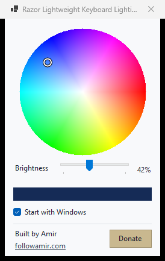

# Razor Lightweight Keyboard Lighting Control

Tiny Windows tray utility for fully customizable Razer Chroma RGB keyboard lighting. Pick any colour, adjust brightness, switch presets, or use global hotkeys without opening Synapse.



## Features

- Full RGB colour wheel for custom keyboard lighting
- Brightness control from 0% to 100%
- Global hotkeys for black, white, and RGB controls
- Fast black and white presets
- Tiny system tray footprint
- Optional `Start with Windows` checkbox
- Light and dark themes

## Download

Download the standalone Windows x64 EXE from [GitHub Releases](https://github.com/AmirMDEV/razer-lighting-switch/releases/latest). No installer or source checkout required.

Requires Windows x64 plus Razer Synapse with Chroma Connect available.

## Hotkeys and controls

- Left-click the tray icon for the RGB wheel and brightness slider
- Tick or untick `Start with Windows` inside the popup
- `Ctrl+Alt+B` sets black
- `Ctrl+Alt+W` sets white
- `Ctrl+Alt+L` opens the RGB wheel
- Right-click the tray icon for presets, startup control, or exit
- Desktop shortcuts `Keyboard Black` and `Keyboard White` remain available through the local install helper

The app uses the local Razer Chroma REST service. Lighting commands stay on the computer.

## Portable use

Run `Razor-Lightweight-Keyboard-Lighting-Control-v1.2.0-win-x64.exe`. Keep the EXE in a permanent folder before enabling `Start with Windows`, since Windows starts that exact file path.

## Support

Built by Amir. Follow Amir at [followamir.com](https://followamir.com).

[Donate to Amir](https://www.paypal.com/donate/?hosted_button_id=2U2GXSKFJKJCA)

## Build

```powershell
powershell -NoProfile -ExecutionPolicy Bypass -File .\scripts\build_release.ps1
```

Logs: `%LOCALAPPDATA%\Amir\RazerLightingSwitch\controller.log`

Settings: `%LOCALAPPDATA%\Amir\RazerLightingSwitch\settings.json`

## License

MIT
